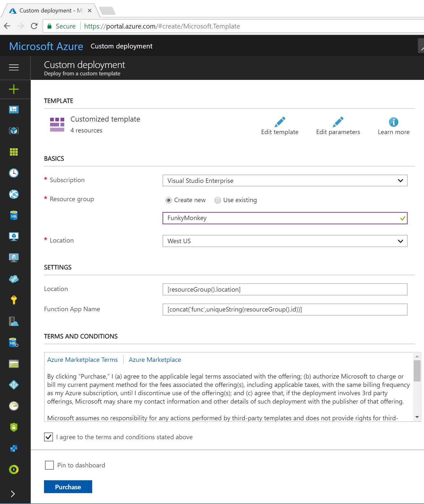
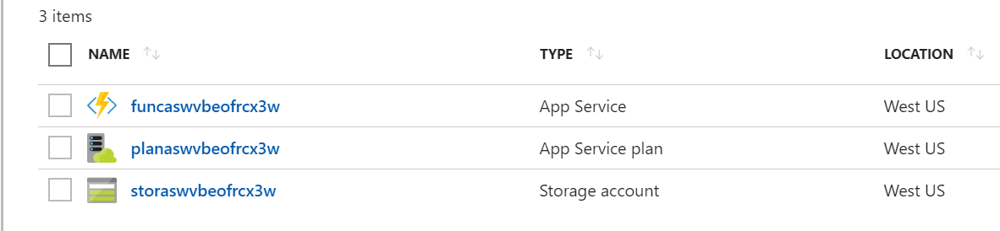
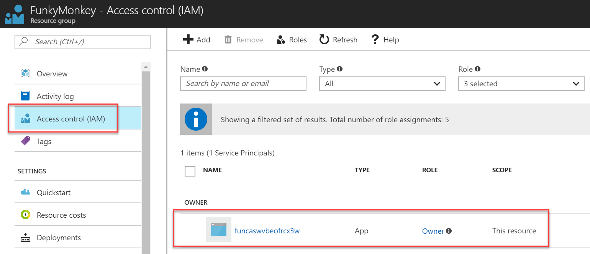
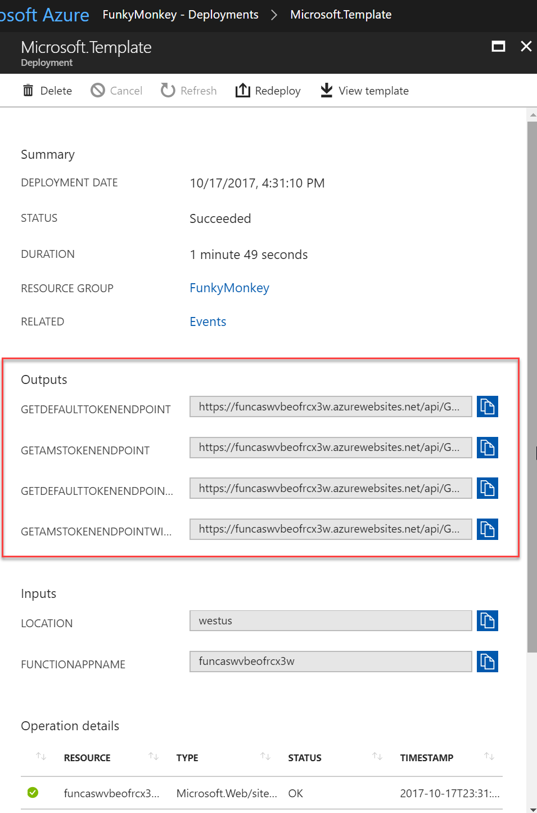
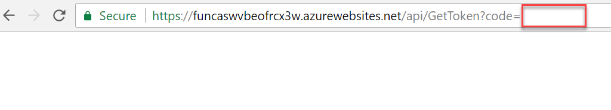
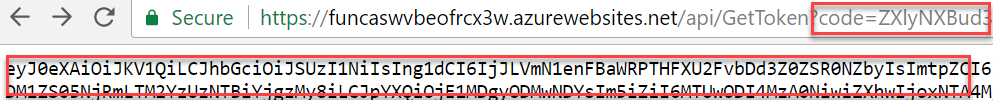

# MSI GetToken Function App
An Azure Function App to help get tokens from a Managed Service Identity (MSI) service configured on the Function App.

The deployment creates the following resources in a resource group:
* An Azure Function App primed with the GetToken function from this repo.
* A "consumption" Azure App Service Plan.
* A standard Azure Storage account.

After deploying this function app finishes, navigate to the deployment log on the Azure Portal and copy the 4 sample URLs provided in the Outputs section. You can use those URL to get a token and perform different tests:
* 2 sample tests for getting a token for use with Azure Resource Manager (ARM) resources (https://management.azure.com/). One sample returns just the access token (valid for 1 hour) and the second sample returns the full token record (access token, expiration, etc...).
* 2 sample tests for getting a token for use with Azure Media Services (AMS) resources (https://rest.media.azure.net). One sample returns just the access token (valid for 1 hour) and the second sample returns the full token record (access token, expiration, etc...).

# A Visual Walkthrough of the Deployment and Use

1. **Upon clicking on the 'Deploy to Azure' button, you are taken to the Azure Portal where the ARM deployment template is loaded into the Custom Template tool.**

2. **When the deployment finishes, 3 resources are created, as mentioned and described above.**

3. **Navigating to the resource group's Access Control (IAM) blade shows that an AAD App Identity (the MSI Identity) has been assigned to the Owner role of the current resource group. This was done as part of the ARM template.**

4. **Navigating to the resource group's Deployments blade and clicking on the deployment name displays the deployment summary where the Outputs section is located. In the outputs section, 4 sample URLs are listed, as described above.**

5. **Taking one of the sample URLs and removing the value of the 'code' querystring parameter results in no output.**

6. **Taking the same sample URL and leaving it as is (with the supplied code querystring parameter value results in a JWT access token returned. The token can be used in ARM operations in the *current* resource group since the MSI identity was assigned to the Owner role of the resource group.**

